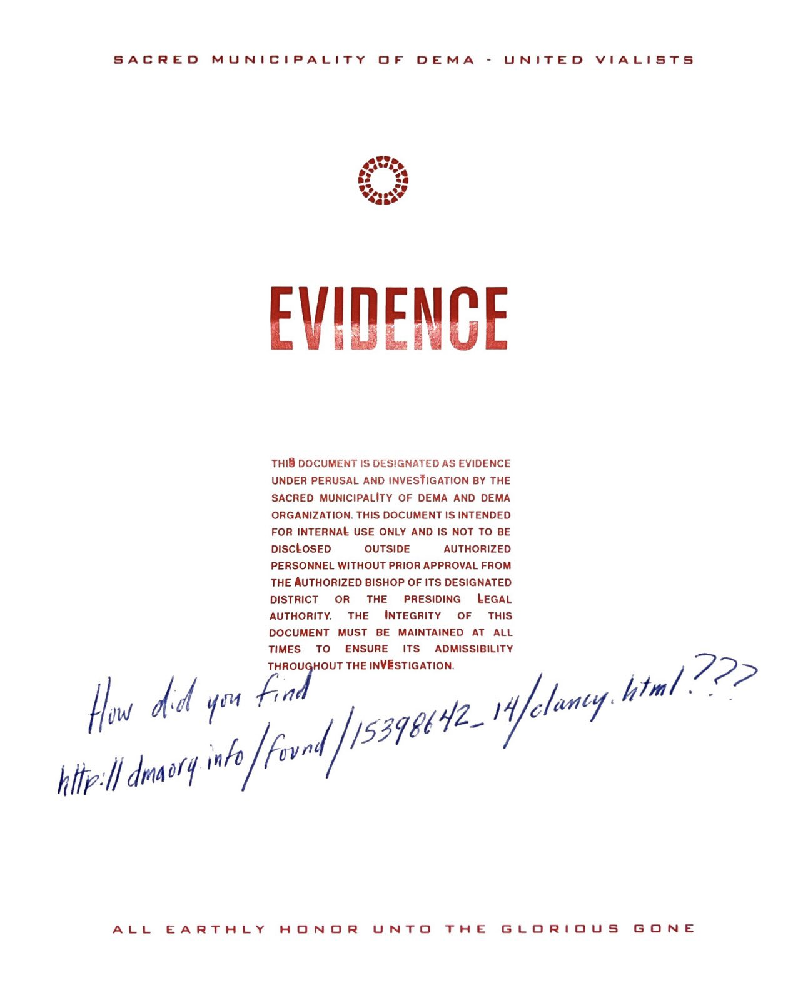
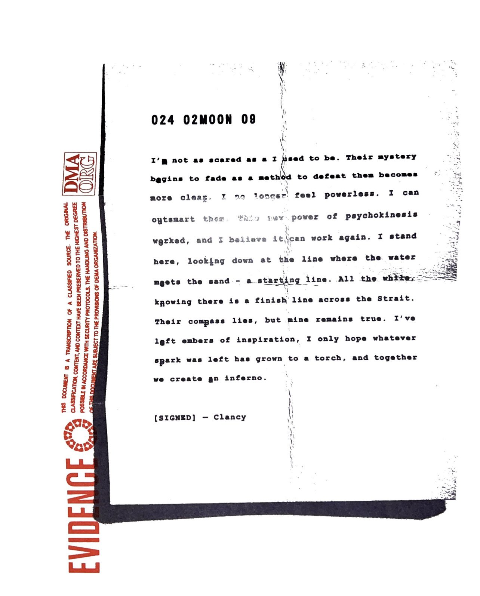

:::warning ATTENTION!
This page refers to a set of physical files. No new updates to the dmaorg.info website were registered on this date.

Alternatively, if you are new to dmaorg.info, check our [Introduction](https://www.twentyonepilots.wiki/docs/trench) page to get started.
:::

:::info
View the scanned documents on [dmaorg archive](https://www.dmaorg.site/physical_letter/index.html)
:::

On February 15th, 2024, fans of the band living in the United States (and afterwards, the United Kingdom) began to report mysterious red envelopes arriving in the mail, labeled as being "sent" by the Sacred Municipality of Dema and adressing their recipients as "CITIZEN". Inside the envelopes was included a printed notification, a document labeled as "EVIDENCE", a map of Trench and lastly, a transcripted letter from Clancy.[^1]

## Red envelope

** Transcription of the sender's information (top-left corner):**
> SACRED MUNICIPALITY OF DEMA
>
> UNITED VIALISTS
>
> CASE NO. 15398642_14

## Notification letter

** Additional Info:**
- The footnote under the letter says "*take excessive measures in attempting to correct or make amends for an error, weakness, or problem*". This is the definition of the word "overcompensate", which was later revealed to be the title of the first single of the upcoming album.
- The number in the top-right corner shows a total of 1500 letters were sent out. Each letter had its number written out by hand.

** Transcription of the letter:**

> YOU HAVE RECENTLY ACCESSED INTERNAL DOCUMENTS PERTAINING TO CASE 15390642_14: [DELINQUENT] CLANCY VS. THE SACRED MUNICIPALITY OF DEMA.
 IN THIS ONGOING INVESTIGATION, WE ARE URGING ANYONE WITH KNOWLEDGE OF THE WHEREABOUTS OF THE ACCUSED TO COME FORWARD WITH RELEVANT INFORMATION ABOUT THE CASE. IT IS REQUIRED THAT ALL INHABITANTS OF DEMA TO DO THEIR DUTY* IN BRINGING ALL ENEMIES OF VIALISM AND ITS TEACHINGS TO SWIFT JUSTICE
>
> -THE HONORABLE BISHOPS OF THE SACRED MUNICIPALITY OF DEMA.

## Evidence letter

**Additional Info:**
- The doubled letters spell out 'still alive'. This suggests that, contrary to the messages we have received [previously](./scaledandicy/clancy-is-dead.mdx), Clancy is not dead.
- Handwritten text over the page says "*How did you find http://dmaorg.info/found/15398642_14/clancy.html???*". This is the link to the original dmaorg website where all the other journals from Clancy have been published.

** Transcription of the letter:**

> THI<b>S</b> DOCUMENT IS DESIGNATED AS EVIDENCE UNDER PERUSAL AND INVES<b>T</b>IGATION BY THE SACRED MUNICIPAL<b>I</b>TY OF DEMA AND DEMA ORGANIZATION. THIS DOCUMENT IS INTENDED FOR INTERNA<b>L</b> USE ONLY AND IS NOT TO BE DISC<b>L</b>OSED OUTSIDE <b>A</b>UTHORIZED PERSONNEL WITHOUT PRIOR APPROVAL FROM THE AUTHORIZED BISHOP OF ITS DESIGNATED DISTRICT OR THE PRESIDING <b>L</b>EGAL AUTHORITY. THE <b>I</b>NTEGRITY OF THIS DOCUMENT MUST BE MAINTAINED AT ALL TIMES TO ENSURE ITS ADMISSIBILITY THROUGHOUT THE IN<b>VE</b>STIGATION.

## Map of Trench

** Additional Info:**
- This map would later appear on the "[I Am Clancy](https://www.youtube.com/watch?v=ozlHHR_eSxc)" video between 0:17-0:38.
- Two major differences between this map and the [black map](./scaledandicy/03-16-22.mdx) added previously to the website are the addition of a new location named "Paladin Strait" and Keons' tower in Dema now showing up as empty.

## Clancy letter - 024 02MOON 09

** Additional Info:**
- A vertical red print labeling the letter as "EVIDENCE" informs the reader that this document is a transcription of a "classified source", which suggests the original file was a journal from Clancy. This would explain the lack of Clancy's handwritten signature at the bottom of the letter.
- This letter would be later published on dmaorg.info in its next update.

** Transcription of the letter:**

> I'<b>m</b> not as scared as a I used to be. Their mystery b<b>e</b>gins to fade as a method to defeat them becomes more clea<b>r</b>. I no longer feel powerless. I can o<b>u</b>tsmart them. This new power of psychokinesis w<b>o</b>rked, and I believe it can work again. I stand here, look<b>i</b>ng down at the line where the water m<b>e</b>ets the sand - a starting line. All the while, k<b>n</b>owing there is a finish Iine across the Strait. Their com<b>p</b>ass lies, but mine remains true. I've l<b>e</b>ft embers of inspiration, I only hope whatever s<b>p</b>ark was left has grown to a torch, and together we create <b>a</b>n inferno. 
>
> [SIGNED] – Clancy

[^1]:Scans are courtesy of [@JOSHESCULT](https://twitter.com/joshescult/status/1758225848266641704) and [@ANTIVISTSLAYER](https://twitter.com/ANTIVISTSLAYER/status/1758322097980350868)
