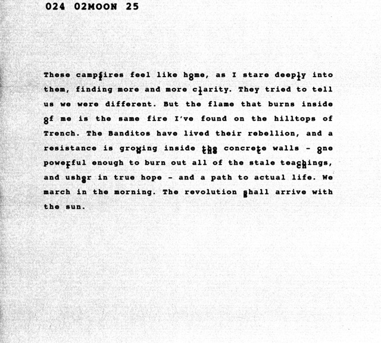
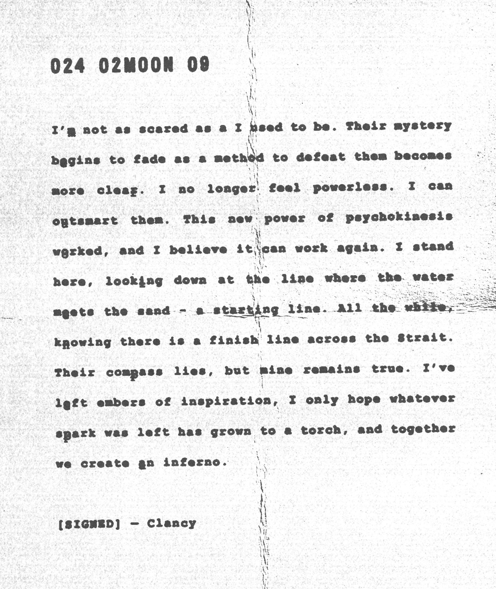

:::info
View the page on [dmaorg archive](https://www.dmaorg.site/022824-5/found/15398642_14/clancy.html)
:::

## 024 02MOON 28 - Day of the update

**File name:**  __cla_im00FFFF.jpeg

**Additional Info:**
- The file name, __cla_im00FFFF.jpeg, includes a hex code for the colour cyan (#00FFFF). The name then spells ‘CLAIM CYAN’, an anagram for 'I AM CLANCY'.
- This journal doesn't feature a Clancy signature at the bottom of the page.
- The doubled letters spell out “fly by” - a lyric from the song Overcompensate that was released a day after this update.

**Transcription of the letter:**

> I <b>f</b>ound a way in. A way they'll never suspect, and a way they'l<b>l</b> never understand. Everything about our cause is so hard for them to understand, but so close to the hearts of the glowing resistance. I can reach them all. I can recruit ever<b>y</b>one with eyes that see beyond the horizon. I can teach them. They can learn what I've learned, and fly <b>by</b> all of the constructs Dema has placed in front of them. We will take it back.

## 024 02MOON 25

**File name:**  _maniac_Clay.jpeg

**Additional Info:**

- The file name, _maniac_Clay.jpeg, is an anagram to "I AM CLANCY" (with one extra a).
- The relevance of this journal's MOON date (February 25th, 2024) is yet unclear.
- This journal doesn't feature a Clancy signature at the bottom of the page as well.
- The doubled letters spell out “follow the torches”.

**Transcription of the letter:**

> These camp<b>f</b>ires feel like h<b>o</b>me, as I stare deep<b>l</b>y into them, finding more and more c<b>l</b>arity. They tried to tell us we were different. But the flame that burns inside <b>o</b>f me is the same fire I've found on the hilltops of Trench. The Banditos have lived their rebellion, and a resistance is gro<b>w</b>ing inside <b>the</b> concre<b>t</b>e walls-<b>o</b>ne powe<b>r</b>ful enough to burn out all of the stale tea<b>ch</b>ings, and ush<b>e</b>r in true hope-and a path to actual life. We march in the morning. The revolution <b>s</b>hall arrive with the sun.

## 024 02MOON 09

** File name:**  _ev-i-D__ence.jpg

** Additional Info:**
- This is the same letter as it was mailed out physically to people a few days prior, but without the red vertical print on the right that labeled it as "EVIDENCE".
- The letter originally appeared on the bottom of the website with the MOON date "0001 11MOON 30", then later was updated to show on the top of the page with the correct date, "024 02MOON 09" (February 9th, 2024). The relevance of both MOON dates is yet unclear.
- Analyzing the position of the doubled letters in each line from the left, we notice that they follow a 2-2-9 pattern - as in, the second letter from the 1st line is doubled, then the second in the 2nd line, then the ninth in the 3rd, etc. When converted into a date (2-29), the numbers hint to February 29th. This would be the release date of the single Overcompensate.
- As far as is known, the letters themselves ("meruoienpepa") do not hold any confirmed significance.

** Transcription of the letter:**

> I'<b>m</b> not as scared as a I used to be. Their mystery b<b>e</b>gins to fade as a method to defeat them becomes more clea<b>r</b>. I no longer feel powerless. I can o<b>u</b>tsmart them. This new power of psychokinesis w<b>o</b>rked, and I believe it can work again. I stand here, look<b>i</b>ng down at the line where the water m<b>e</b>ets the sand - a starting line. All the while, k<b>n</b>owing there is a finish Iine across the Strait. Their com<b>p</b>ass lies, but mine remains true. I've l<b>e</b>ft embers of inspiration, I only hope whatever s<b>p</b>ark was left has grown to a torch, and together we create <b>a</b>n inferno. 
>
> [SIGNED] – Clancy
