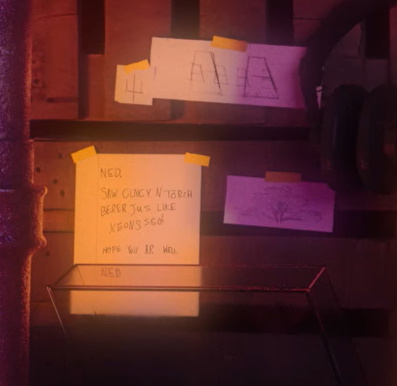

## 11/23/2023 - Ned's Cozy Fireplace 

On November 23 2023, the band released a 10 hour video of relaxing tunes. This video features Ned sitting by a fireplace while lofi versions of twenty one pilots song play.  

<iframe width="800" height="534" src="https://www.youtube.com/embed/s1K00Fiz_0Q" title="Ned&#39;s Cozy Fireplace - 10 Hours of Relaxing Twenty One Pilots Mixes" frameborder="0" allow="accelerometer; autoplay; clipboard-write; encrypted-media; gyroscope; picture-in-picture; web-share" allowfullscreen></iframe>

In the background, a bookshelf can be seen. On one of the shelves, books are arranged in a 229 pattern - two books, a gap, two books, another gap, and nine books. This hinted towards the band's return on the 29th of February (2/29), where the single Overcompensate was released.

On one of the walls, a few notes taped to the wall can be seen -  a sketch of the sai symbol, a sketch of the neon gravestones, a tree,  and a note from Ned.

** Transcript of the note **
> Ned,
>
> saw clncy n torch berer jus like keons sed
>
> hope you ar well
>
> Ned