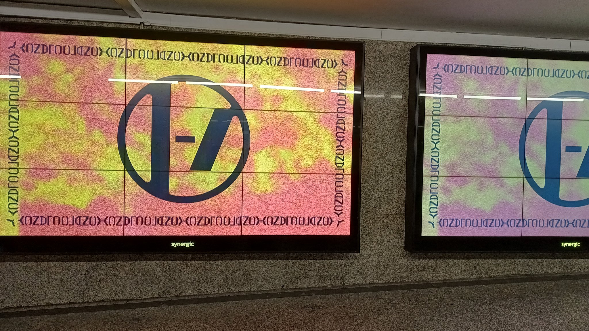
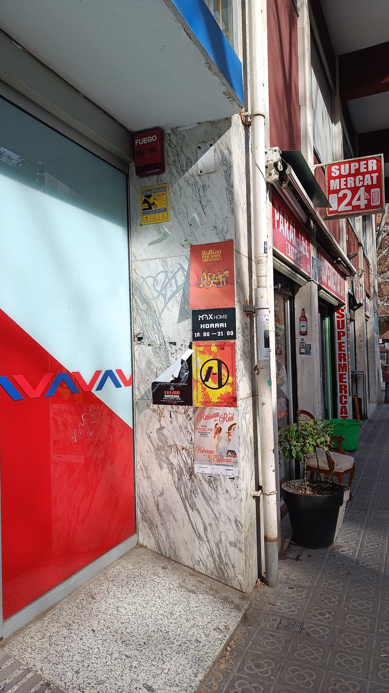
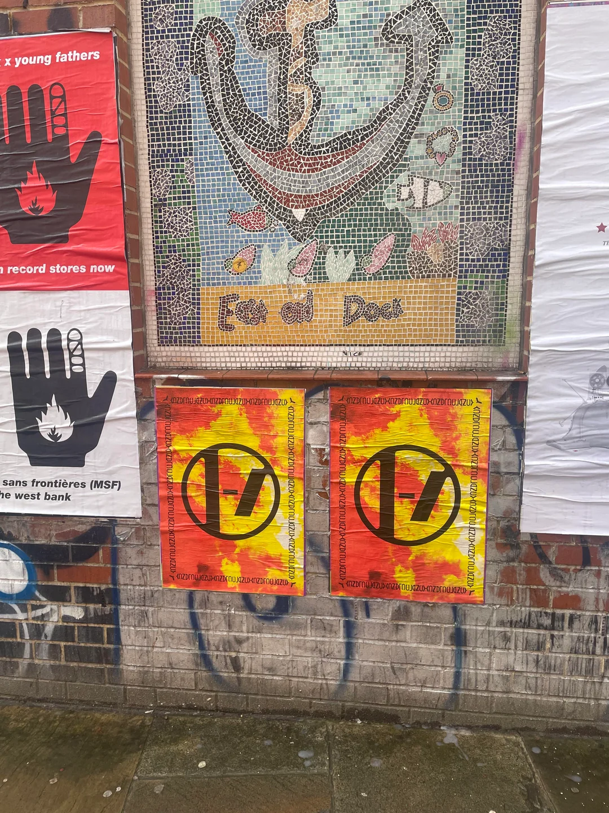
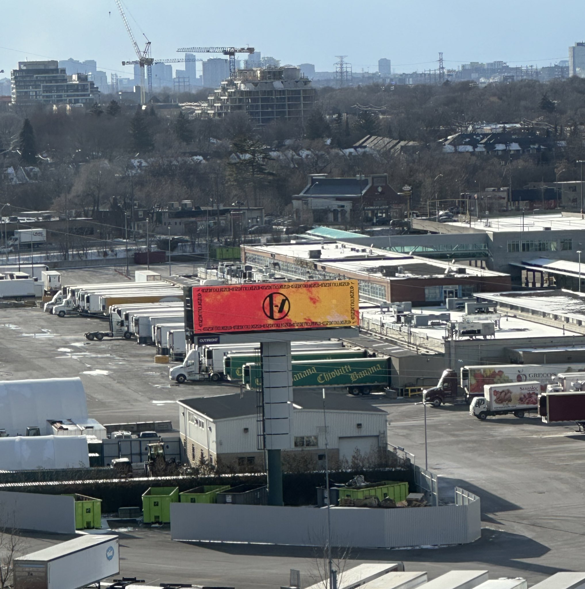
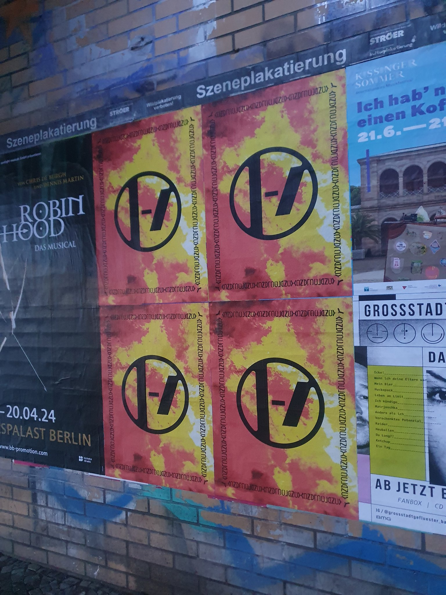
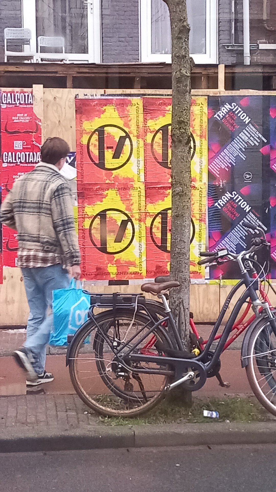
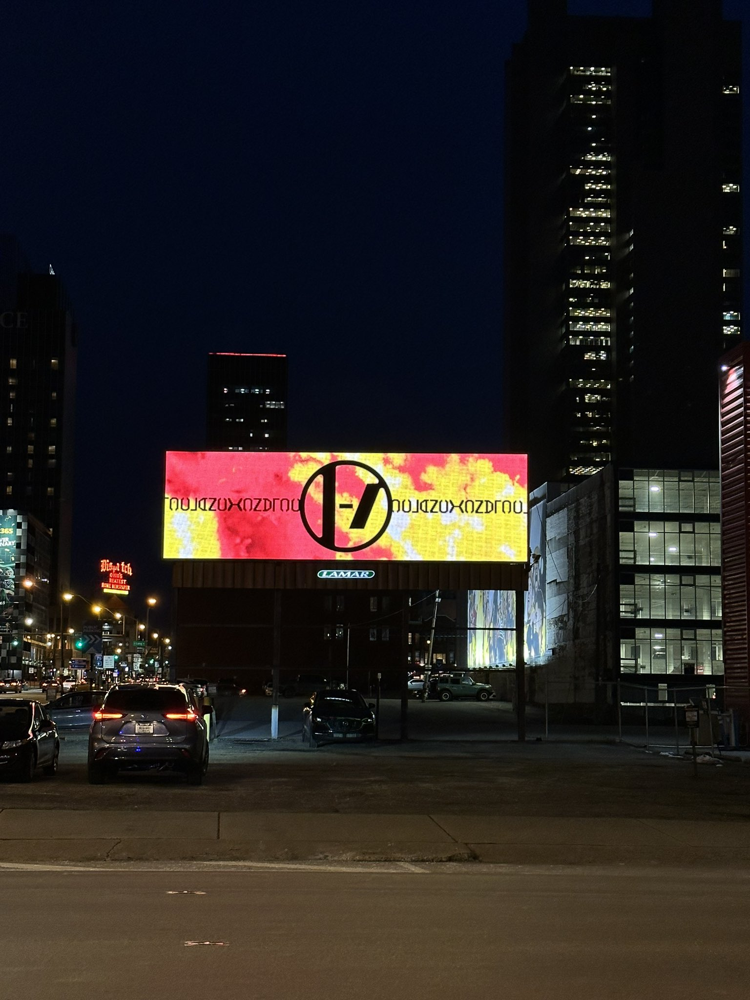
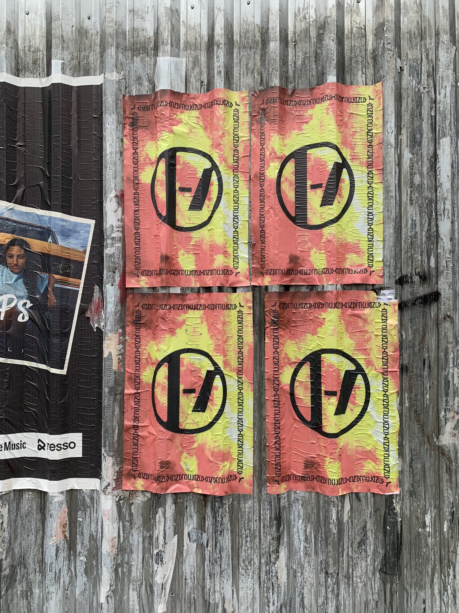

import clancyPoster from "./assets/clancyposter.png";
import voldsoy from "./assets/voldsoy.png";
import styles from "./styles/style.module.css";

Starting in February 17th, 2024 and throughout the following days, promotional posters for Clancy - the band's upcoming album - were spotted in multiple cities. The posters all included the new band logo over a yellow and red background. The writing on the sides spells "Clancy" and "Voldsoy".[^1]

Warsaw, Poland[^2]

Barcelona, Spain[^3]

London, United Kingdom[^4]

Toronto, Canada[^5]

Berlin, Germany[^6]

Amsterdam, the Netherlands[^7]

Columbus, Ohio[^8]

Rio de Janeiro, Brazil[^9]

Please note that this is a non-exhaustive list.

[^1]: Image credit to [u/maluajj](https://www.reddit.com/r/twentyonepilots/comments/1atasvu/i_may_be_stupid/?utm_source=share&utm_medium=web2x&context=3) on Reddit
[^2]: Photo credit to [@f4ll_aw4y](https://twitter.com/f4ll_aw4y/status/1758824392845295679)
[^3]: Photo credit to [@janabaye](https://twitter.com/janabaye/status/1759572710638686517?t=-ao30tnHlhhyRCR07QOOtw&s=19)
[^4]: Photo credit to [u/Putrid_League4389](https://www.reddit.com/r/twentyonepilots/comments/1aum5rl/spotted_in_london/?utm_source=share&utm_medium=web3x&utm_name=web3xcss&utm_term=1&utm_content=share_button) on Reddit
[^5]: Photo credit to [@scaledandiced](https://twitter.com/scaledandiced/status/1758975373407105101/photo/1)
[^6]: Photo credit to [@Skeleton_boo](https://twitter.com/Skeleton_boo/status/1759674667395145858/photo/1)
[^7]: Photo credit to [@localbandito](https://twitter.com/localbandito/status/1761417743742472539/photo/1)
[^8]: Photo credit to [@JoeJ1700](https://twitter.com/JoeJ1700/status/1760470629654917276)
[^9]: Photo credit to [@acervopilots](https://twitter.com/acervopilots/status/1759989110196797885)
