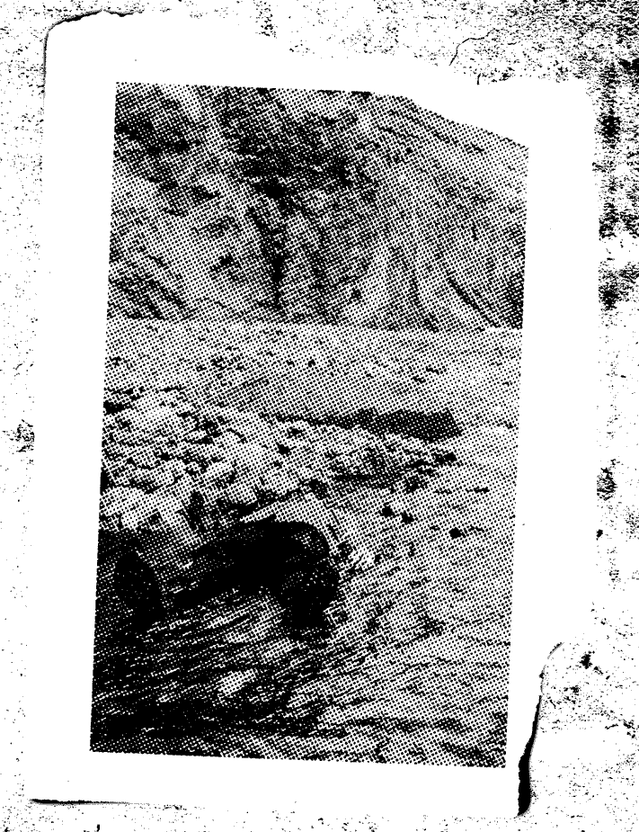

:::info
View the page on [dmaorg archive](https://www.dmaorg.site/terminating/found/15398642_14/clancy.html)
:::

At around 3PM Eastern time, dmaorg.info received its first update since the fourth journal entry was added in January 2019 (Chlorine Update).

The entire website has been inverted, now appearing black with the images also showing up inverted. The only exceptions are the map (*_ti_su_p.png*), the Tyler photo (*2_1_2.gif*), and the black letter (*he_a_vy.jpg*), all of which show up “normally” on the page.

A progress bar was added to the top of the page, showing the progress of “//Terminating Files.”

Above the loading progress bar, after “*//Terminating Files…*”, various files names would be typed out and then erased continuously, ranging from actual file names contained inside the dmaorg website to randomly generated strings of letters and numbers followed by a file format.

The progress bar would also repeatedly load itself, then stop and restart as it reached a certain percentage - which would increase steadily as the time passed and change every time the page was refreshed. Its time of conclusion was determined by a constant value inside the script of the website - 259,200 seconds, equal to 3 days. Therefore, the loading bar was programmed to fill up completely on Monday, April 5th, at 3PM Eastern Time.

There is also one significant update to one of the files contained previously on the page:

## **017 02MOON 12 - “Stressed Out” wins Grammy for Best Pop Duo/Group Performance**

**File name:** _.jpg

**Additional info:**

- While the name of the file did not change nor did the MOON date above it, the color of the tape has been altered. The image currently shows up on the inverted site as a paler blue tape while the original image seems to be a paler red tape.

- The original tape was a bright yellow signifying Trench.

- The red and blue have been noted to be similar to the shades used for the Regional At Best era band logo.

What it looks like on the page:

Original:

