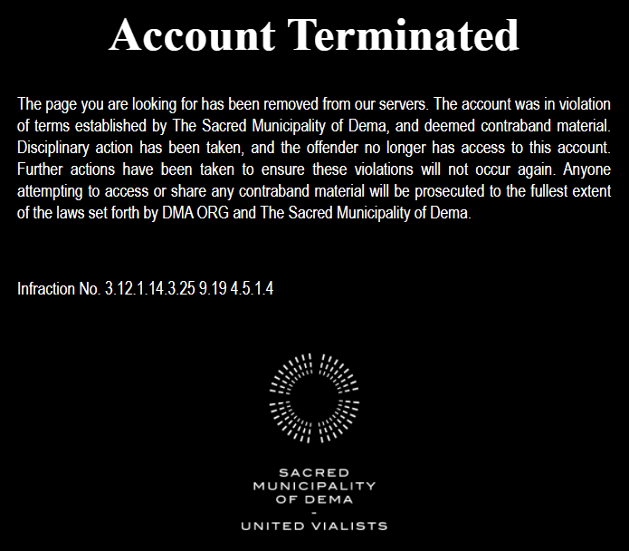
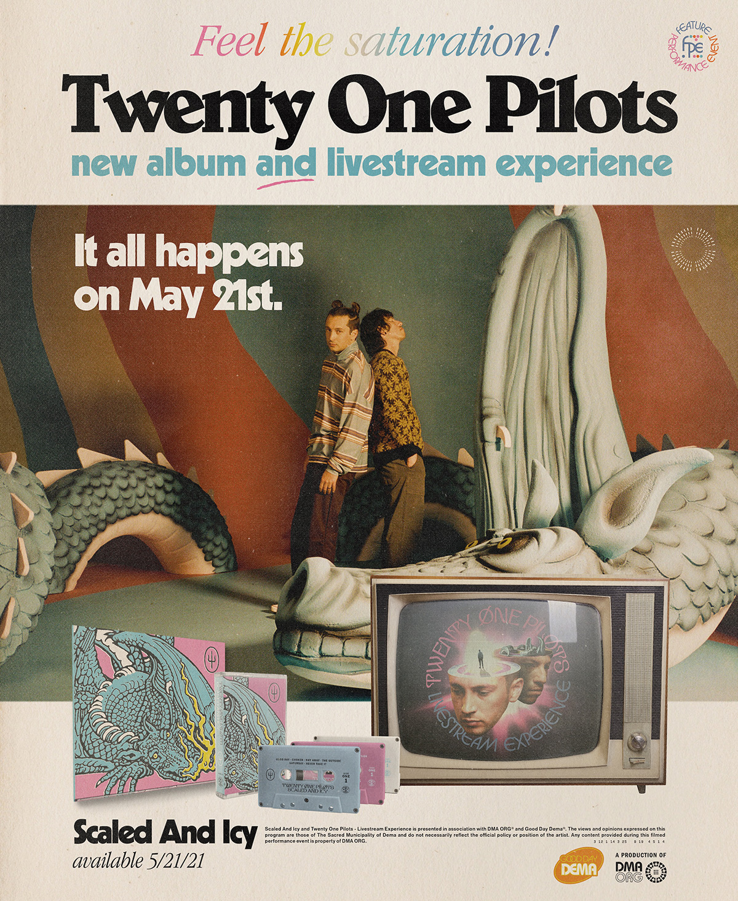

:::info
View the page on [dmaorg archive](https://www.dmaorg.site/terminated/found/15398642_14/clancy.html)
:::

As expected, the loading bar reached 100% on April 5th, at 3PM EST. After this, the website refreshed itself and all of its previous content disappeared, being replaced by an error message titled “Account Terminated”.

- When the infraction number (3.12.1.14.3.25 9.19 4.5.1.4) is translated (using A=1, B=2, etc.), it spells out “CLANCY IS DEAD”.  
  

- Moreover, in the error message, the letter  *o* in the word *offender* turns into an *ø* when you hover it. By clicking it, a poster advertising a new album and a livestream pops up. In total, there are three posters. The text at the bottom of each poster reads as it follows:

 
> “Scaled and Icy and Twenty One Pilots – Livestream Experience is presented in association with DMA ORG and Good Day Dema. The views and opinions expressed on this program are those of The Sacred Municipality of Dema and do not necessarily reflect the official policy or position of the artist. Any content provided during this filmed performance event is property of DMA ORG. 3.12.1.14.3.25 9.19 4.5.1.4”

**Additional Info:**

- The dragon on the album cover has lines in its body which look exactly like the aerial view of Clancy Way - a street in Columbus, Ohio, where the music videos for Truce and Goner were filmed. Additionally, another set of lines resemble letters spelling "DESTROY".

- The acronym “FPE” (previously meaning “the Few, the Proud, the Emotional” from the Blurryface song “Fairly Local” and also “Failed Perimeter Escape” from the dmaorg file *ba_dge.jpg*) reappears once again in the posters as an abbreviation for “Feature Event Performance”.

- Trivia: A notable motif (acknowledged by themselves and the fans) seen in almost all of Tyler and Josh’s previous public appearances as a band, including shows, photoshoots and interviews is that Tyler always places himself to the left of Josh. The three posters, however, do not follow this pattern

