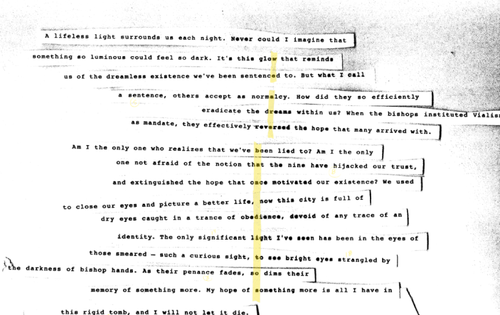

:::info
View the page on [dmaorg archive](https://www.dmaorg.site/070118/found/15398642_14/clancy.html)
:::

This update correlates to the fifth eye tweet, from “Kitchen Sink”: “Nobody dreams when they blink.”

**File name:** i.gif

**Additional Info:**
- The gif shows a cinereous vulture blinking and turning its head, as something calls its attention.

## 018 07MOON 01 – July 1st - Day of the update

**File name:** _e_sr__eve_r_.jpg

**Additional Info:**

- The lines from this journal were stripped and put together to spell a hidden message, visible only with the yellow tape image available in the same update.

- The yellow tape highlights the message “WE ARE BANDITOS” vertically, in reference to the audio file found in [http://dmaorg.info/found/2018_514_3_8/clancy.html](http://dmaorg.info/found/2018_514_3_8/clancy.html). As the file name suggests, you need to “reverse” the audio to hear the message.

<blockquote>

&emsp;&emsp;&emsp;“A lifeless light surrounds us each night. Never could I imagine that   
 &emsp;&emsp;&emsp;something so luminous could feel so dark. It's this glo<mark class="highlight-yellow">w</mark> that reminds   
 &emsp;&emsp;&emsp;&emsp;&emsp;us of the dreamless existence we've been sentenc<mark class="highlight-yellow">e</mark>d to. But what I call   
 &emsp;&emsp;&emsp;&emsp;&emsp;&emsp;&emsp;&emsp;&emsp;&emsp;&emsp;a sentence, others accept as norm<mark class="highlight-yellow">a</mark>lcy. How did they so efficiently   
 &emsp;&emsp;&emsp;&emsp;&emsp;&emsp;&emsp;&emsp;&emsp;&emsp;&emsp;&emsp;&emsp;&emsp;&emsp;&emsp;&emsp;&emsp;&emsp;eradicate the d<mark class="highlight-yellow">r</mark>eams within us? When the bishops instituted Vialism   
 &emsp;&emsp;&emsp;&emsp;&emsp;&emsp;&emsp;&emsp;&emsp;&emsp;&emsp;&emsp;&nbsp;&nbsp;as mandate, they effectively rev<mark class="highlight-yellow">e</mark>rsed the hope that many arrived with.   
 &emsp;&emsp;&emsp;&emsp;&emsp;&emsp;Am I the only one who realizes that we've <mark class="highlight-yellow">b</mark>een lied to? Am I the only   
 &emsp;&emsp;&emsp;&emsp;&emsp;&emsp;&emsp;&emsp;&emsp;&emsp;&nbsp;&nbsp;one not afraid of the notion th<mark class="highlight-yellow">a</mark>t the nine have hijacked our trust,   
 &emsp;&emsp;&emsp;&emsp;&emsp;&emsp;&emsp;&emsp;&emsp;&nbsp;&nbsp;and extinguished the hope that o<mark class="highlight-yellow">n</mark>ce motivated our existence? We used to close our eyes and picture a better life, now this city is full of   
 &emsp;&emsp;&emsp;&emsp;&emsp;&emsp;&emsp;&emsp;&emsp;dry eyes caught in a trance of obe<mark class="highlight-yellow">d</mark>ience, devoid of any trace of an   
 &emsp;&emsp;&emsp;&emsp;&emsp;&emsp;&emsp;&emsp;&emsp;&emsp;&emsp;identity. The only significant l<mark class="highlight-yellow">i</mark>ght I've seen has been in the eyes of   
 &emsp;&emsp;&emsp;&emsp;&emsp;&emsp;&emsp;&nbsp;&nbsp;those smeared - such a curious sight, <mark class="highlight-yellow">t</mark>o see bright eyes strangled by   
 the darkness of bishop hands. As their penance fades, s<mark class="highlight-yellow">o</mark> dims their   
 &emsp;&emsp;&emsp;&emsp;&emsp;&nbsp;&nbsp;&nbsp;memory of something more. My hope of <mark class="highlight-yellow">s</mark>omething more is all I have in   
 this rigid tomb, and I will not let it die.
</blockquote>
 

 ![A lifeless light surrounds us each night. Never could I imagine that something so luminous could feel so dark. It's this glow that reminds us of the dreamless existence we've been sentenced to. But what I call a sentence, others accept as normalcy. How did they so efficiently eradicate the dreams within us? When the bishops instituted Vialism as mandate, they effectively reversed the hope that many arrived with. Am I the only one who realizes that we've been lied to? Am I the only one not afraid of the notion that the nine have hijacked our trust, and extinguished the hope that once motivated our existence? We used to close our eyes and picture a better life, now this city is full of dry eyes caught in a trance of obedience, devoid of any trace of an identity. The only significant light I've seen has been in the eyes of those smeared - such a curious sight, to see bright eyes strangled by the darkness of bishop hands. As their penance fades, so dims their memory of something more. My hope of something more is all I have in this rigid tomb, and I will not let it die](./assets/alttext.png)
 

## 017 02MOON 12 - “Stressed Out” wins Grammy for Best Pop Duo/Group Performance

**File name:** _.jpg

**Additional info:**

- The yellow tapes highlight the message “WE ARE BANDITOS” when you overlay the file over the third Clancy letter.

- Six numbers are also visible in the image. When reordered, they spell the violation code on the Trench page: 20-18-5-14-3-8.

- The letters “E N D” are circled in yellow.

- This image was posted in the same update as the reverse letter. However, it is the first to be placed between older images on the dmaorg site

&emsp;&emsp;
