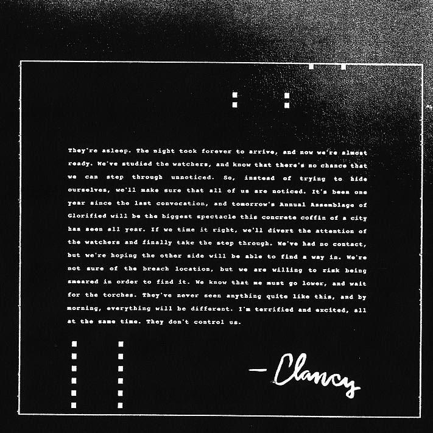

**File name:**  _o__ut_.jpg

**Additional Info:**

- The picture shows a relatively flat structure in the distance, close to the left border before the incline, with a centerpiece protruding from its silhouette. It is later revealed that this is a silhouette of Dema.

- The file name implies that this is Clancy finally looking back at Dema after they have escaped from the city.

## 018 07MOON 05- July 5th - Day of the update

**File name:** he_a_vy.jpg

**Additional info:**

- Unlike the other journals, this one has a black background and white text.

- Nine pairs of white squares point to six different letters vertically placed above or below the squares in the journal (the number of squares specifying the number of lines into the paragraph to count up/down). The letters spell the message “WAKE UP.”
- This update correlates to the sixth eye tweet, from “Message Man”: *“Remember the morning is when night is dead.”*

**Transcription of the letter:**

> “They're asleep. The night took forever to arrive, and now we're almost ready. We've studied the watchers, and know that there's no chance that we can step through unnoticed. So, instead of trying to hide ourselves, we'll make sure that all of us are  noticed. It's been one year since the last convocation, and tomorrow's Annual Assemblage of Glorified will be the biggest spectacle this concrete coffin of a city has seen all year. If we time it right, we'll divert the attention of the watchers and finally take the step through. We've had no contact, but we're hoping the other side will be able to find a way in. We're not sure of the breach location, but we are willing to risk being smeared in order to find it. We know that we must go lower, and wait for the torches. They've never seen anything quite like this, and by morning, everything will be different. I'm terrified and excited, all at the same time. They don't control us.”

