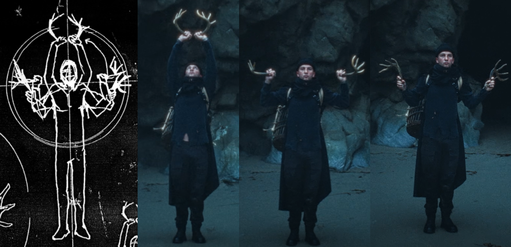

:::info
View the page on [dmaorg archive](https://www.dmaorg.site/031822-1/found/15398642_14/clancy.html)
:::

## 022 03MOON 18  - Day of the Update

Shortly after ["The Outside" music video](https://www.youtube.com/watch?v=eNcvblM8-_o) went live, dmaorg updated again adding a sketch of a weapon along with a diagram of movements. 

**Transcription of the text seen throughout the drawing:**
> SEIZE KEONS
>
> ψυχή κίνησις
> 
> seize available vessel
> at Voldsøy eastern cove
> intercept bishops.
> 
> glorious gone = available vessel
> 
> bishops control the available vessel!
> intercept and seize
>
> they will make you a weapon.

** File name: ** w-eap-ø-n.jpg

**Additional Info:**

- At the top left, there is text that when read top down, right to left, reads "SEIZE KEONS".
- The text seen near the center left is in Greek - it reads ψυχή κίνησις ("psychí kínisis"), which translates to "psychokinesis" (also known as "telekinesis"), the paranormal ability to move objects through mental effort.
- Above the text in Greek, a diagram showcases a pair of antlers from a Ned creature over a drawing of a human body hoisted upside-down by its feet. The hoisted body maintains a distinctive pose which greatly resembles the statues seen throughout Dema in the ["Nico and the Niners" music video](https://www.youtube.com/watch?v=hMAPyGoqQVw).

- As seen in "The Outside" music video, Tyler was able to seize Keons' dead body by holding the antlers given from a Ned creature while performing the series of movements outlined in the diagram.

