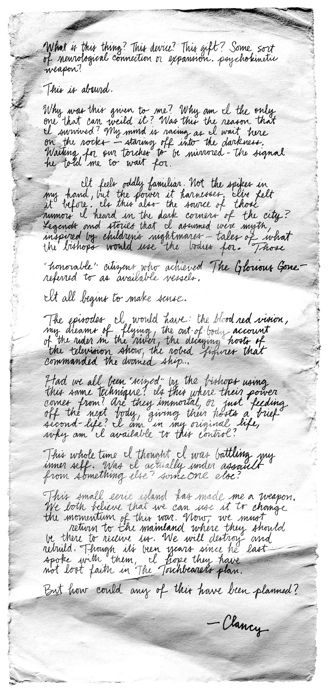

:::info
View the page on [dmaorg archive](https://www.dmaorg.site/031822-2/found/15398642_14/clancy.html)
:::

Shortly after "[The Outside](https://www.youtube.com/watch?v=eNcvblM8-_o)" music video went live, dmaorg.info updated again, adding a new handwritten note along with a diagram of a "weapon" featuring a series of outlined movements. 

## 022 03MOON 18 - Day of the update

**File name:** 1619250308151109140519-Ø-919.jpg

**Additional Info:**

- The numbers in the file name (1619250308151109140519919) translate to "psychokinesis" (1 = A, 2 = B, etc.).
- The psychokinesis technique described in the letter is detailed on the diagram of this same update. It allows the bishops (and Clancy) to "seize" and take control of a dead body.
- A physical pop-up shop named "Ned's Bayou" - later turned into an [online store](https://www.nedbayou.com) - opened for the first time in June 28th, 2019, revealing that "Ned" is an acronym for "Neuro-Expansion Device", which is referenced in the note. 
- The mention of an "out of body account of the rider in the river" refers to the third-person perspective of Tyler being smeared by a bishop, as seen in the "[Jumpsuit](https://www.youtube.com/watch?v=UOUBW8bkjQ4)" music video. This suggests that Clancy was seeing himself being smeared at the time - and that Clancy is Tyler. 
- The beginning of the last paragraph (*'This small eerie island has made me a weapon...'*) is later referenced in the "[I Am Clancy](https://www.youtube.com/watch?v=ozlHHR_eSxc)" video, as well as in the song "Overcompensate". 

**Transcription of the note:**

> What is this thing? This device? This gift? Some sort of neurological connection or expansion. psychokinetic weapon?
> 
> This is absurd.
> 
> Why was this given to me? Why am I the only one that can weild it? Was this the reason that I survived? My mind is racing as I wait here on the rocks -- staring off into the darkness. Waiting for our torches to be mirrored - the signal he told me to wait for.
> 
> It feels oddly familiar. Not the spikes in my hand, but the power it harnesses, I've felt it before. Is this also the source of those rumors I heard in the dark corners of the city? Legends and stories that I assumed were myth, inspired by children's nightmares -- tales of what the bishops would use the bodies for. Those "honorable" citizens who acheived The Glorious Gone -- referred to as available vessels.
> 
> It all begins to make sense.
> 
> The episodes I would have: the blood red vision, my dreams of flying, the out of body account of the rider in the river, the decaying hosts of the television show, the robed figures that commanded the doomed ship...
> 
> Had we all been "seized" by the bishops using this same technique? Is this where their power comes from? Are they immortal, or just feeding off the next body, giving their hosts a brief second-life? I am in my original life, why am I available to this control?
> 
> This whole time I thought I was battling my inner self. Was I actually under assault for something else? someONE else?
> 
> This small eerie island has made me a weapon. We both believe that we can use it to change the momentum of this war. Now, we must return to the mainland where they should be there to receive us. We will destroy and rebuild. Though it's been years since he last spoke with them, I hope they have not lost faith in The Torchbearers plan.
> 
> But how could any of this have been planned?
> 
> \- Clancy

## 022 03MOON 18

**Transcription of the text seen throughout the drawing:**
> SEIZE KEONS
>
> ψυχή κίνησις
> 
> seize available vessel
>
> at Voldsøy eastern cove
>
> intercept bishops.
> 
> glorious gone = available vessel
> 
> bishops control the available vessel!
>
> intercept and seize
>
> they will make you a weapon.

** File name: ** w-eap-ø-n.jpg

**Additional Info:**

- The letters on the top left can be read as "SEIZE KEONS" when read top down, right to left.
- The text seen near the center left is in Greek and reads ψυχή κίνησις ("psychí kínisis"). These two words can be translated separately as "soul" (or 'mind') and "movement" - together, they form the portmanteau "psychokinesis" ("psychokínisi"), the paranormal ability to move objects through mental effort, also known as "telekinesis".
- Above the Greek text, a diagram showcases a pair of antlers from a Ned creature over a drawing of a human body hoisted upside-down by its feet. The hoisted body maintains a distinctive pose which greatly resembles the statues seen throughout Dema in the "[Nico and the Niners](https://www.youtube.com/watch?v=hMAPyGoqQVw)" music video.

- As seen in "The Outside" music video, Tyler was able to seize Keons' body by holding the antlers given from a Ned creature while performing the series of movements outlined in the diagram.

