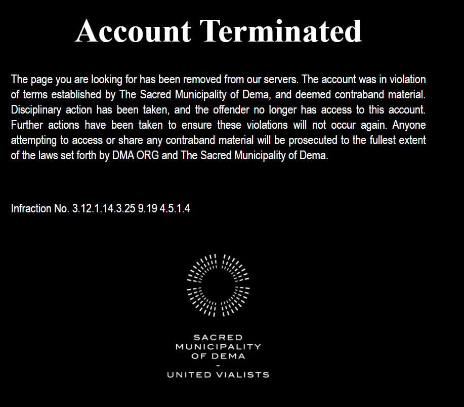
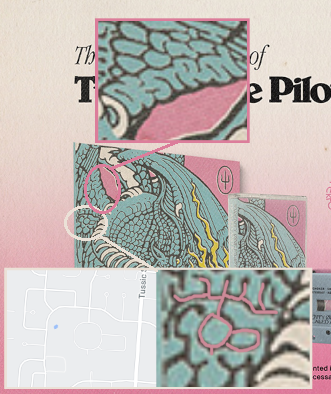

## 04/02/21 3PM EST - Dmaorg updated

Termination bar - Thus, the bar is going to fill on Monday, Apr 5 at 3 PM EDT

Inverted colours

Randomly generated files on top

## 04/05/21 2PM EST - Blurryface reveals the album name

One hour before the dmaorg.info website got terminated, at 2PM EST, the BLURRYFACE twitter account posted a tweet revealing the new record name: Scaled And Icy, which is also an anagram for “Clancy Is Dead”.

## 04/05/21 3PM EST - Dmaorg terminated

On April 5th at 3PM EST, all of the previous content in the dmaorg.info website disappeared, being replaced by an error message titled “Account Terminated” and an infraction number (3.12.1.14.3.25 9.19 4.5.1.4), which can be translated (using A=1, B=2, etc.) to spell out “CLANCY IS DEAD”.

Moreover, in the error message, the letter o in the word offender turns into an ø when you hover it. By clicking it, a poster advertising a new album and a livestream pops up. In total, there are three posters. The text at the bottom of each poster reads as it follows.

“Scaled and Icy and Twenty One Pilots – Livestream Experience is presented in association with DMA ORG and Good Day Dema. The views and opinions expressed on this program are those of The Sacred Municipality of Dema and do not necessarily reflect the official policy or position of the artist. Any content provided during this filmed performance event is property of DMA ORG. 3.12.1.14.3.25 9.19 4.5.1.4”

(Image: Poster “1.jpg”)

(Image: Poster “2.jpg”)

(Image: Poster “3.jpg”)

The dragon on the album cover has lines which look exactly like Clancy Way - a street in Columbus, Ohio where music videos for Truce and Goner were filmed.
Additionally, some of the lines resemble letters spelling "Destroy"

