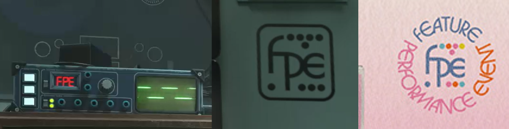
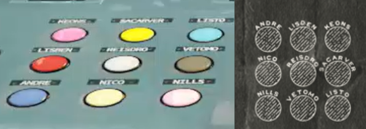
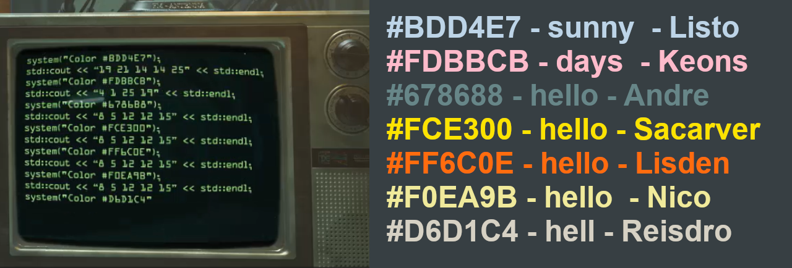
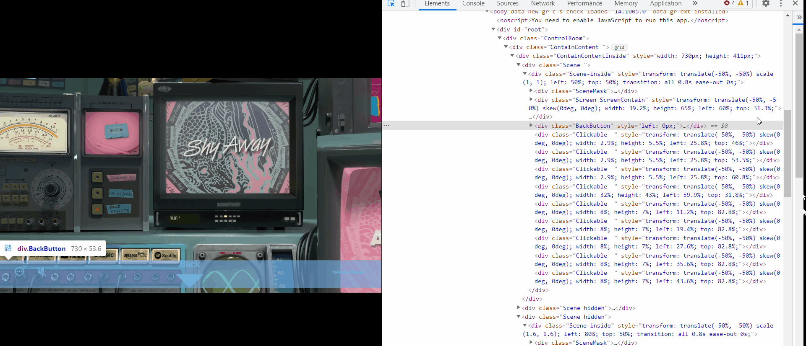

import v1 from './assets/v1.mp4';
import intro from './assets/introscreen.mp4';

## 07/04/21 - Livestream experience website

Following the release of the band's single 'Shy Away', the website https://live.twentyonepilots.com/ went online. It displayed a TV screen playing a speech of Josh explaining the "Livestream Experience". 
The website also included links to the merch store, and the possibility to buy tickets for the "Livestream experience" - an online concert on May 21st 2021. [^1]

<video controls height="500px">
  <source src={intro}/>
</video>

After purchasing a ticket for the livestream experience, a control room pannel became available. The various screens advertised new merch and the upcoming album, and easter eggs were hidden all over the room.

<video controls height="500px">
  <source src={v1}/>
</video>

** Easter eggs in the original version of the page:**

The radio player screen displays the letters "FPE". We can also see the FPE logo printed out on the right side of the merch screen. This is the same logo as we have seen in the promotional sai posters, signifying "Feature Performance Event". FPE has be present over the eras, but it's meaning has changed every time -  in Blurryface it represented the Few, the Proud, the Emotional and during Trench it signified a Failed Perimeter Escape. 

On the bottom of the pannel, 9 buttons can be seen. Each button is labelled with a name of one of the nine bishops. This is the same pattern as in the original dmaorg website, but rotated by 90 degrees. Lisden's name on the control pannel is misspelled and says "Lisben".

On one of the screens on the right side, a pattern of numbers and hexcodes is printed. In each line, the numbers spell out a word (A = 1, B = 2, etc.) and the hexcode corresponds to a colour of one of the buttons mentioned above. 

The bottom left has a few ports with cables and words printed above them. As it was revealed later, these were words from lyrics in Scaled and Icy.

One of the screens on the left side is showing a clip advertising the new album. When you open the source code and delete this video, the Jumpsuit music video can be seen.

## Later updates to the page
(video)

- test patterns (version 6) and inverted dema map (april 23)
- Vialism booklet (version 8)
- dema discs on the wall (version 9)
- webcam feature (v9 and v11 when it actually worked)
- screens showing posters (version 15) may 17

## Artopia
- artopia 

## Q&A event
- trivia (may 14)
- behind the scenes
- Q&a (also same day)

## Inside the lyrics
- inside the lyrics

[^1]: Credit to [@spark_visuals](https://twitter.com/spark_visuals) for archived versions of the control room page.