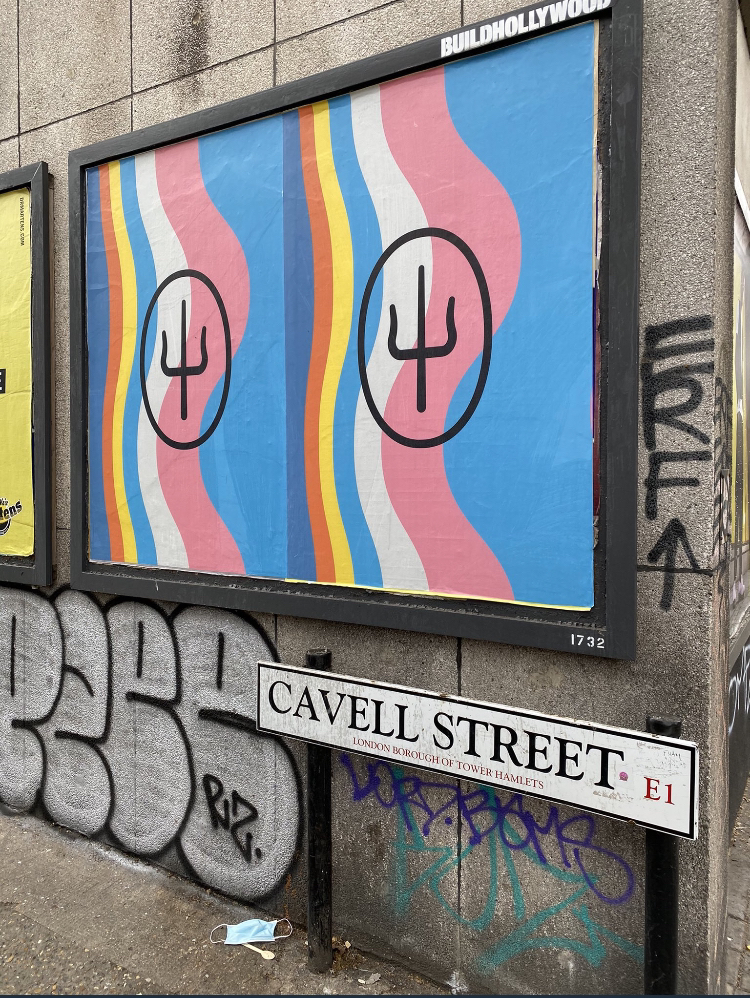
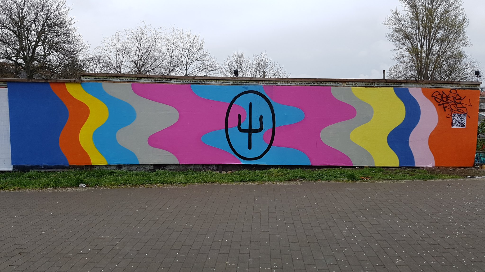
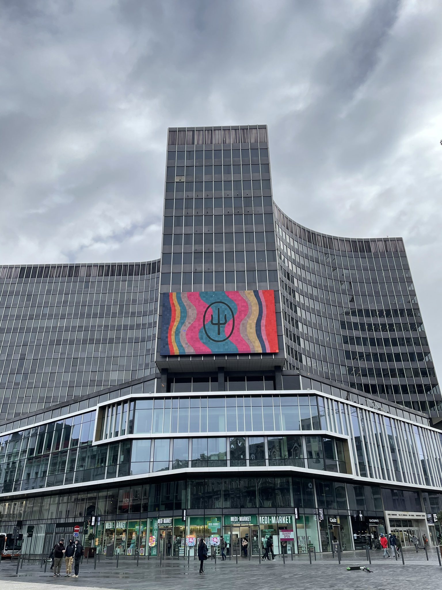
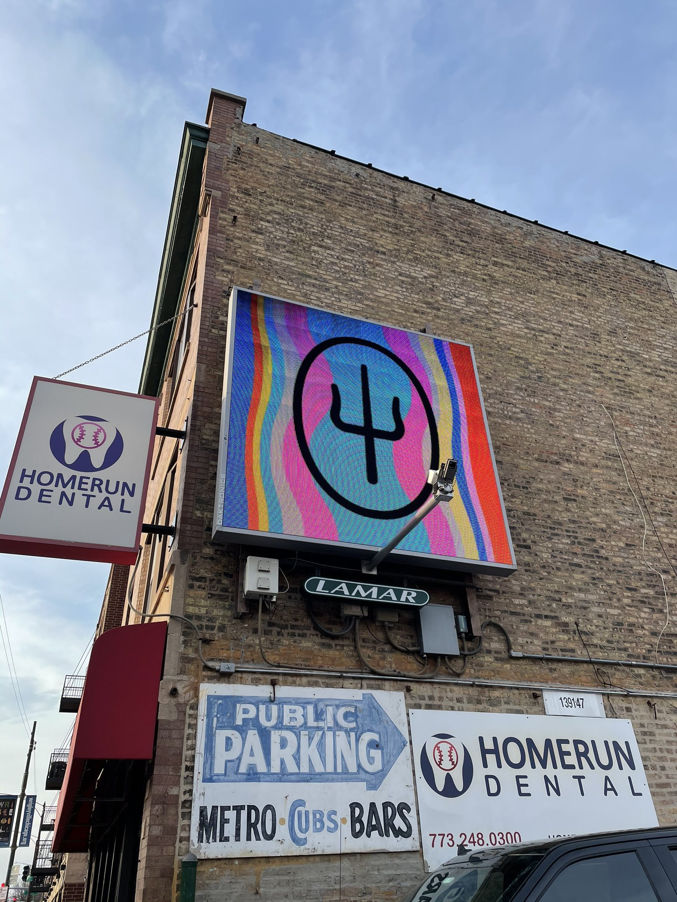
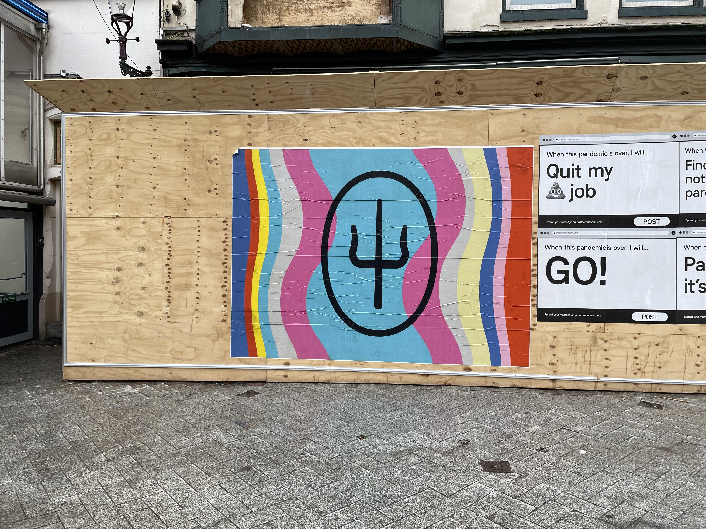
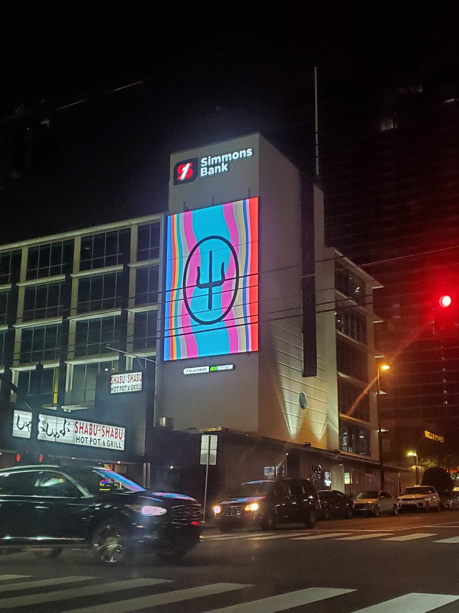
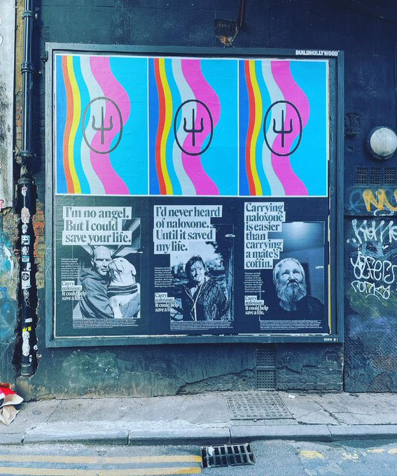

Starting on April 6th, 2021, and throughout the next days, multiple promotional posters have been spotted in different cities, all containing the SAI logo over different patterned backgrounds. 

In London, United Kingdom:

Berlin, Germany:

Brussels, Belgium:

Chicago, Illinois:

Mexico City, Mexico:

Amsterdam, the Netherlands:

Nashville, Tennessee:

Manchester, United Kingdom:

