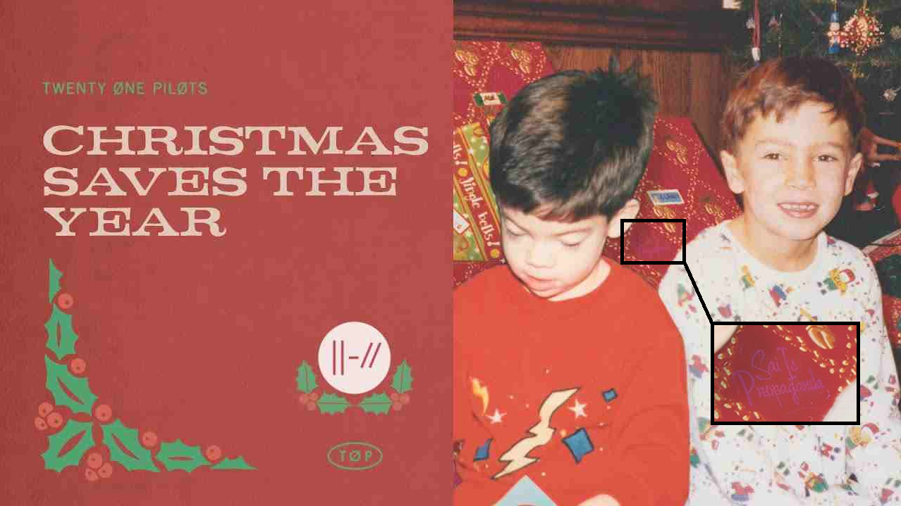

## 12/08/20 - “Christmas Saves The Year” single released

In the cover art of the single “Christmas Saves The Year”, a secret message can be seen written over a gift wrapping in the background of the picture behind Tyler and Josh, where it reads “Sai Is Propaganda”.

It is later revealed that "Sai" is an acronym for the next Twenty One Pilots’ album name, Scaled And Icy. Afterwards, the logo of the band was updated to resemble a sai, a traditional melee weapon from Okinawan martial arts used for thrusting and blocking. It also similar to the greek letter psi. 

