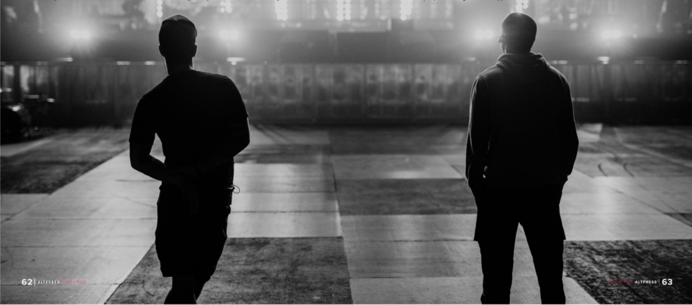
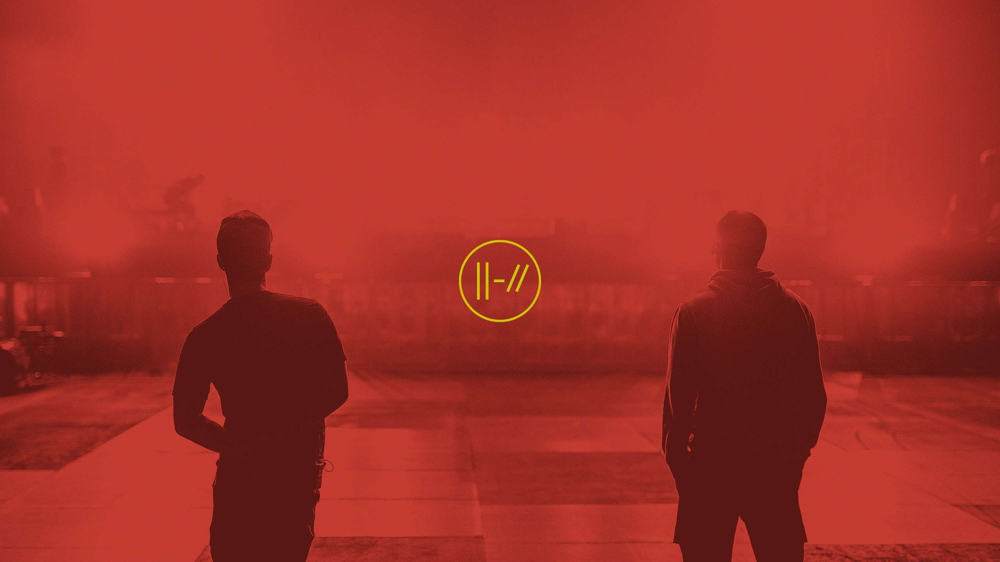
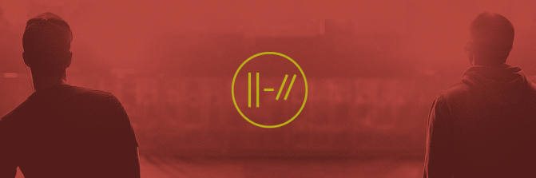
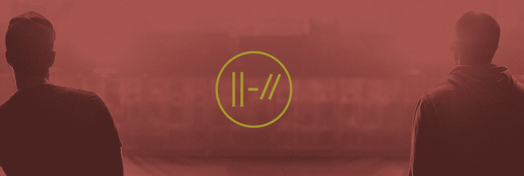
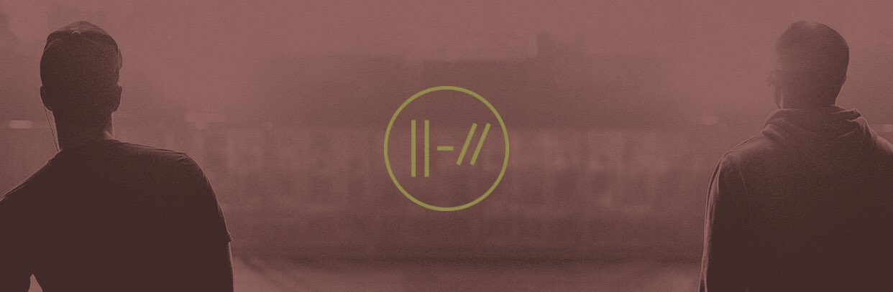
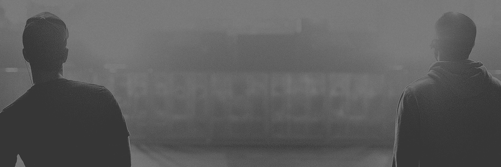
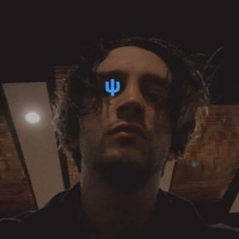

import booberang from './assets/boomerang.mp4';

## 01/07/21 to 03/31/21 - Twitter header desaturation

On January 7th, 2021, the band updated their Twitter, Youtube, and official website headers to an image that could be found earlier on in an AltPress interview magazine (#384). The photo was taken during a show of the Trench era. A bright red filter was initially applied over it, as well as the band’s yellow Trench logo.

The original image: 

The band’s social media header on January 7th, updated at 4:27PM EST:

Starting on March 3rd at 2:53PM EST, the Twitter header started to desaturate consistently between one week intervals, progressively losing its original red color by 21% with each update. The yellow logo also began to fade:

On March 10th, at 3:12PM EST:

March 17th, at 2:57PM EST:

March 24th, at 3PM EST:

Finally, on March 31st at 3PM, the header fully desaturated and lost all of its color. The logo also disappeared completely.

## 02/05/21 - Tyler’s profile changes

On February 5th 2021, Tyler updated his profile picture on Twitter and Instagram to a selfie with a blue sai logo over his right eye. 

He also changed his Twitter header to a dark solid brown and took Trench out of his bio.

## 03/09/21 - Instagram’s boomerang video

On March 9th 2021, a boomerang video was uploaded to the band’s Instagram story.

<video controls height="500px">
  <source src={booberang}/>
</video>
