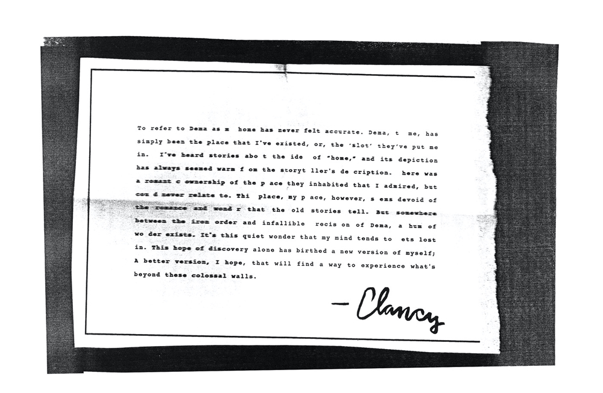

---

id: 05-09-18-second-journal-added
title: 05/09/18 - Second journal added
description: A second typed journal is added to the website, describing Clancy's feelings towards Dema and the idea of "Home".
keywords:
  - wiki
  - second journal
  - clancy
  - dema
---

:::info
View the page on [dmaorg archive](https://www.dmaorg.site/050918/found/15398642_14/clancy.html)
:::

## 017 07MOON 07

**File name:** 017_07MOON_07.jpg

**Additional Info:**

- The MOON date (July 7th, 2017) marks the official first day of the band's hiatus between Blurryface and Trench. On the previous day (July 6, 2017), a sequence of tweets were posted by the official band account on Twitter/X featuring a [red eye](https://twitter.com/twentyonepilots/status/882999193161388033) gradually closing. The [final tweet](https://twitter.com/twentyonepilots/status/883144349449682944) of this sequence would be followed by a year-long break with no social media activity from the band.
- Some letters in the journal were purposefully blanked out to spell the message “YOU ARE STILL SLEEPING”.

:::
**Transcription of the letter:**
> “To refer to Dema as m<b>[y]</b> home has never felt accurate. Dema, t<b>[o]</b> me, has simply been the place that I've existed, or, the 'slot' they've put me in. I've heard stories abo<b>[u]</b>t the ide<b>[a]</b> of "home," and its depiction has always seemed warm f<b>[r]</b>om the storyt<b>[e]</b>ller's de<b>[s]</b>cription. <b>[T]</b>here was a romant<b>[i]</b>c ownership of the p<b>[l]</b>ace they inhabited that I admired, but co<b><[l]</b>d never relate to. Thi<b>[s]</b> place, my p<b>[l]</b>ace, however, s<b>[e]</b>ems devoid of the romance and wond<b>[e]</b>r that the old stories tell. But somewhere between the iron order and fallible <b>[p]</b>recis<b>[i]</b>on of Dema, a hum of wo<b>[n]</b>der exists. It's this quiet wonder that my mind tends to <b>[g]</b>ets lost in. This hope of discovery alone has birthed a new version of myself; A better version, I hope, that will find a way to experience what's beyond these colossal walls.

:::note There are a few grammatical errors in this journal.

1. “gets” instead of “get”

2. “myself; A better” instead of “myself; a better”
