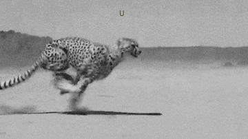

:::info
View the page on [dmaorg archive](https://www.dmaorg.site/053118/found/15398642_14/clancy.html)
:::

## 017 07MOON 16

**File name:** 3lurr.gif

**Additional Info:**

- The MOON date (July 16th, 2017) is the eve before the day Twenty One Pilots won the award for "[Most Dedicated Fanbase](https://www.youtube.com/watch?v=OHcgbe_ZYYY)" at the 2017 Alternative Press Music Awards (APMAs). Josh showed up by himself to receive the award, justifying Tyler's absence by saying he was off "severing ties with Dema". This would mark the first time the city of Dema is directly referenced by its name.
- The gif is a black-and-white stabilized snippet of a cheetah running. Each individual frame of the gif flashes a letter on top of it.
- The full message says "U STILL DONT KNOW HIS REAL NAME DO U?" along with the letters “NICONICO” in each of the spaces between the words -- UNSTILLIDONTCKNOWOHISNREALINAMECDOOU?
- This is a reference to Nico, the only bishop whose name didn’t correlate to his corresponding song in Blurryface, “Stressed Out.”
- The snippet is originally a scene from the movie Duma (2005).
